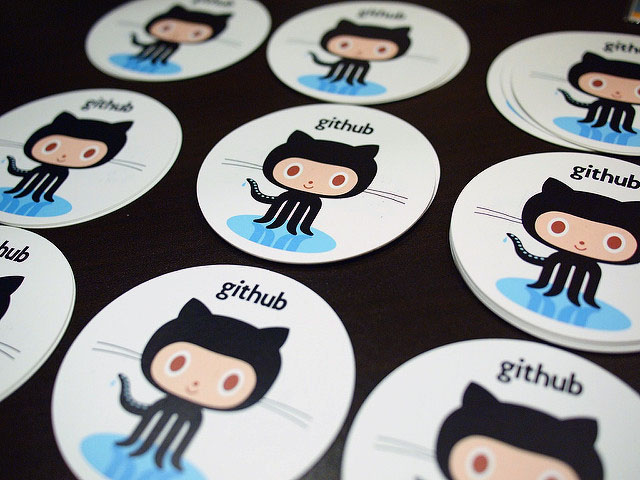
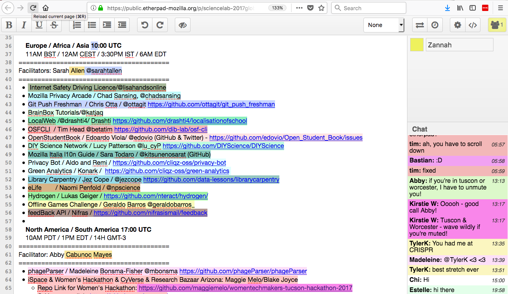
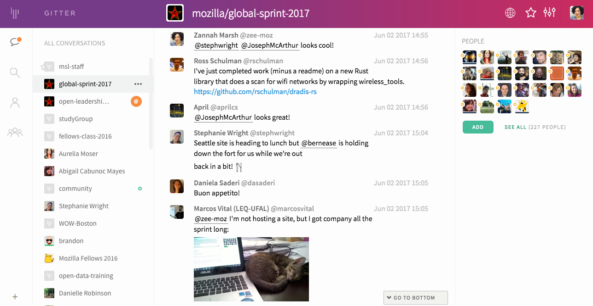

**The Global Sprint is a great opportunity to experiment with collaboration tools and techniques, and with working open.** These are some of the tried and true tools that we suggest you use for the Global Sprint-- tools that Mozilla staff use in our day-to-day work. 

 
###### image by othree

### GitHub
GitHub is an online platform for collaborative work. At the Sprint, participants and project leads use GitHub to share and discuss project plans and materials, assign work, and make changes to code or content. Software projects may use GitHub’s full functionality to accept code changes, while projects that aren’t code-heavy may use GitHub simply to list, discuss and assign tasks. Project work can happen elsewhere-- in word processing or design apps, in code editors, or on regular old paper.  

**You DON’T need to be an expert in GitHub to participate or lead a project at the Sprint. If you’ve written a blog post or posted a comment online, used an online forum, clicked around a website to find information, or used tags to search for content on a site, many of GitHub’s basic collaboration features will be familiar.** !

[github convo](../img/ghconvo.png)

###### a conversation in GitHub issues at the 2017 sprint

To prepare for the Sprint, project leads use GitHub to set up a collection of project files (called a repository), create project documentation in the repository, and create “issues” or chunks of work that participants can help with. Our [Project Lead Guide](https://mozilla.github.io/global-sprint/project-lead-guide/) includes GitHub tutorials, tips, and templates. Participants use GitHub learn about projects, see what tasks they might take on, and discuss and share work. See the [Participant Guide](https://mozilla.github.io/global-sprint/participants-guide/) for tutorials and tips. 

### Etherpad
Etherpad is a web-based text editor for note-taking and collaboration. One way we use etherpad is during our video calls, to keep track of the schedule, and share notes and comments on project updates. We also use this tool for group brainstorming, or to draft collaborative documents.

Participants add their name and pick a color at top right-- when they type text or comments in the main pad window or the chat window at right, anything they type will be marked with their signature color.  
 
 
 
At the Global Sprint, feel free to jump into our shared etherpad conversations and add comments/notes wherever you want, or ask questions of other participants. You can also add a +1 next to someone else's comment to show that you "like" it. You don’t need to sign in to use Etherpad-- just type in your name at right and start commenting! 

### Gitter Chat
Gitter Chat is an application for chatting online.  You can join the Global Sprint channel here, signing in with a GitHub account or Twitter ID.  In the run-up to the sprint, you can ask all your site, project, and participant questions here.  Pop in and introduce yourself-- you can use it to chat with others about your plans for the sprint, and get advice from veteran sprinters. During the sprint, we use Gitter Chat for site and project updates, comments, questions, requests for help on issues, and of course to share Sprint-related cat photos! 

 

### Vidyo
Finally, we use the video conferencing software Vidyo during the sprint. We have “demo” or demonstration calls scheduled throughout the Sprint-- you can join to hear what other sites and Sprinters are working on. It’s a great way to learn about the full range projects in the Sprint, and connect with Sprinters around the world. Instructions for using Vidyo are here https://public.etherpad-mozilla.org/p/globalsprint-webconferencing
